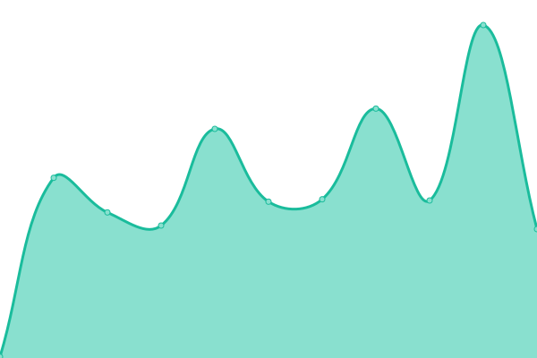

# Formspark status

📈 [Live status](https://status.formspark.io)

📣 [Twitter](https://twitter.com/formsparkapp)

<!--start: status pages-->
<!-- This summary is generated by Upptime (https://github.com/upptime/upptime) -->
<!-- Do not edit this manually, your changes will be overwritten -->

| URL                                                              | Status | History                                                                                                                     | Response Time                                                                                   | Uptime                                                                                                                                                                                                                                          |
| ---------------------------------------------------------------- | ------ | --------------------------------------------------------------------------------------------------------------------------- | ----------------------------------------------------------------------------------------------- | ----------------------------------------------------------------------------------------------------------------------------------------------------------------------------------------------------------------------------------------------- |
| [formspark.io](https://formspark.io)                             | 🟩 Up  | [formspark-io.yml](https://github.com/formspark/status/commits/master/history/formspark-io.yml)                             |  173ms               |                              |
| [backend.formspark.io](https://backend.formspark.io)             | 🟩 Up  | [backend-formspark-io.yml](https://github.com/formspark/status/commits/master/history/backend-formspark-io.yml)             |  428ms       |              |
| [dashboard.formspark.io](https://dashboard.formspark.io)         | 🟩 Up  | [dashboard-formspark-io.yml](https://github.com/formspark/status/commits/master/history/dashboard-formspark-io.yml)         |  155ms     |          |
| [documentation.formspark.io](https://documentation.formspark.io) | 🟩 Up  | [documentation-formspark-io.yml](https://github.com/formspark/status/commits/master/history/documentation-formspark-io.yml) |  127ms |  |

<!--end: status pages-->
