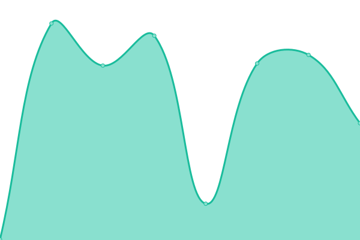
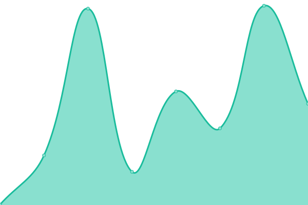

# Formspark status

📈 [Live status](https://status.formspark.io)

📣 [Twitter](https://twitter.com/formsparkapp)

<!--start: status pages-->
<!-- This summary is generated by Upptime (https://github.com/upptime/upptime) -->
<!-- Do not edit this manually, your changes will be overwritten -->
<!-- prettier-ignore -->
| URL | Status | History | Response Time | Uptime |
| --- | ------ | ------- | ------------- | ------ |
|  [formspark.io](https://formspark.io) | 🟩 Up | [formspark-io.yml](https://github.com/formspark/status/commits/HEAD/history/formspark-io.yml) | 

 118ms
     
 | 

<a href="https://status.formspark.io/history/formspark-io">100.00%</a>
    

|  [backend.formspark.io](https://backend.formspark.io) | 🟩 Up | [backend-formspark-io.yml](https://github.com/formspark/status/commits/HEAD/history/backend-formspark-io.yml) | 

 448ms
     
 | 

<a href="https://status.formspark.io/history/backend-formspark-io">100.00%</a>
    

|  [dashboard.formspark.io](https://dashboard.formspark.io) | 🟩 Up | [dashboard-formspark-io.yml](https://github.com/formspark/status/commits/HEAD/history/dashboard-formspark-io.yml) | 

 73ms
     
 | 

<a href="https://status.formspark.io/history/dashboard-formspark-io">100.00%</a>
    

|  [submitted.formspark.io](https://submitted.formspark.io) | 🟩 Up | [submitted-formspark-io.yml](https://github.com/formspark/status/commits/HEAD/history/submitted-formspark-io.yml) | 

 75ms
     
 | 

<a href="https://status.formspark.io/history/submitted-formspark-io">100.00%</a>
    

|  [documentation.formspark.io](https://documentation.formspark.io) | 🟩 Up | [documentation-formspark-io.yml](https://github.com/formspark/status/commits/HEAD/history/documentation-formspark-io.yml) | 

 109ms
     
 | 

<a href="https://status.formspark.io/history/documentation-formspark-io">100.00%</a>
    

<!--end: status pages-->
